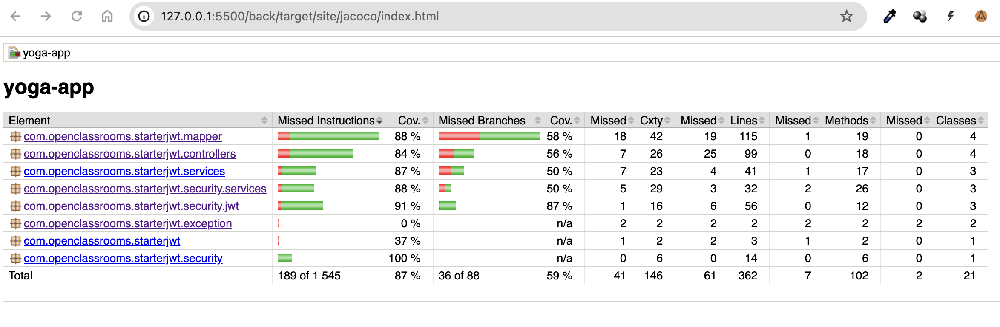

> [!NOTE]
>Ce fichier est un guide pour installer et tester l'application Yoga (gestion de reservations de cours de Yoga). C'ette application est composé d'une API (back-end) et d'une UI Web (Front-end). Bonne installation !

<h1>TABLE DES MATIERES:</h1>

- [1 - INSTALLATION DE LA BASE DE DONNÉE](#1---installation-de-la-base-de-donnée)
  - [Installer MySQL (MacOS)](#installer-mysql-macos)
  - [Installer MySQL (Windows)](#installer-mysql-windows)
- [2 - Création de la base de donnée de production (MacOS et Windows)](#2---création-de-la-base-de-donnée-de-production-macos-et-windows)
- [3 - Demarrer le projet](#3---demarrer-le-projet)
  - [Cloner le projet en local](#cloner-le-projet-en-local)
  - [Demarrer l'API (Back-End)](#demarrer-lapi-back-end)
    - [Installez Maven (MacOs)](#installez-maven-macos)
    - [Installez Maven (Windows)](#installez-maven-windows)
    - [Demarrer Spring-Boot](#demarrer-spring-boot)
  - [Demarrer le site web (Front-End)](#demarrer-le-site-web-front-end)
- [4 - Executer les tests sur le Back-End](#4---executer-les-tests-sur-le-back-end)
  - [Tests unitaires \& d'intégration](#tests-unitaires--dintégration)
  - [Rapport de couverture des tests Back-End](#rapport-de-couverture-des-tests-back-end)
- [5 - Executer les tests sur le Front-End](#5---executer-les-tests-sur-le-front-end)
  - [Tests unitaires \& d'intégration](#tests-unitaires--dintégration-1)
  - [Rapport de couverture des tests unitaires et d'intégration](#rapport-de-couverture-des-tests-unitaires-et-dintégration)
- [6 - Tests End-to-End (E2E)](#6---tests-end-to-end-e2e)
  - [Rapport de couverture des tests E2E](#rapport-de-couverture-des-tests-e2e)

# 1 - INSTALLATION DE LA BASE DE DONNÉE
La base de donnée est une base Open Source MySQL (SQL, « Structured Query Language » est un langage standardisé utilisé
pour gérer et manipuler les bases de données relationnelles).

## Installer MySQL (MacOS)
- Pour installer MySQL sur un Mac, vous pouvez utiliser Homebrew, un gestionnaire de paquets pour macOS. 
- Installer Homebrew:
  ```/bin/bash -c "$(curl -fsSL https://raw.githubusercontent.com/Homebrew/install/HEAD/install.sh)"```
  
- Installer MySQL: ```brew services start mysql```
- Démarrer le service MySQL: ```brew services start mysql```
- Se connecter à la base de donnée: ```mysql -u root -p```
  *(Cela vous demandera de saisir le mot de passe de l'utilisateur root. Par défaut, le mot de passe est vide, donc vous pouvez simplement appuyer sur Entrée.)*
- Definissez un mot de passe pour l'utilisateur root:```ALTER USER 'root'@'localhost' IDENTIFIED BY 'password';``` puis: ```FLUSH PRIVILEGES;```
  *(remplacez password par votre mot de passe)*

## Installer MySQL (Windows)
- Allez sur le site de téléchargement de MySQL : https://dev.mysql.com/downloads/installer/
- Télécharger la version "MySQL Installer for Windows".
- Une fois le téléchargement terminé, ouvrez le fichier d'installation.
- Suivez les instructions de l'installateur.
- Une fois l'installation terminée, vous pouvez démarrer le serveur MySQL en utilisant le service MySQL dans le Panneau de configuration de Windows.

# 2 - Création de la base de donnée de production (MacOS et Windows)
- Ovrez une invite de commande (Windows) ou une fenetre de terminal (MacOS).
- Se connecter à la base de donnée: ```mysql -u root -p```
  *(Cela vous demandera de saisir le mot de passe de l'utilisateur root.)*
- Créez la base de donnée "test": ```CREATE DATABASE test;```(Ceci est la base de PRODUCTION !)
- Selectionnez la base de donnée créé: ```USE test;```
- Créez les TABLES en utilisant le script SQL fournit: ```source ressources/sql/script.sql;``` *(remplacer par le chemin vers votre fichier de script "script.sql")*
- Vous pouvez maintenant quitter MySQL en tapant `exit` et en appuyant sur Entrée.

# 3 - Demarrer le projet
## Cloner le projet en local
- Naviguez vers le répertoire où vous voulez cloner le dépôt GitHub.
- Une fois dans le répertoire souhaité, tapez la commande suivante et appuyez sur Entrée: `git clone https://github.com/DiD-BDX/OCP5-Test-App-Full-Stack.git`

Maintenant, le dépôt GitHub devrait être cloné dans un nouveau dossier dans le répertoire actuel. Ce dossier aura le même nom que le dépôt.

Vous y trouverez 2 sous-dossiers, un pour le Front-End "front" et un pour le Back-End "back".

## Demarrer l'API (Back-End)

### Installez Maven (MacOs)
- Installez Maven si il n'est pas deja installé à l'aide de Homebrew: `brew install maven`
- Pour vérifier que Maven est bien installé, vous pouvez exécuter la commande suivante : `mvn -v`

### Installez Maven (Windows)
- Ouvrez une invite de commande en mode administrateur.
- Installez Maven si il n'est pas deja installé à l'aide de Chocolatey (par exemple): ```Set-ExecutionPolicy Bypass -Scope Process -Force; [System.Net.ServicePointManager]::SecurityProtocol = [System.Net.ServicePointManager]::SecurityProtocol -bor 3072; iex ((New-Object System.Net.WebClient).DownloadString('https://chocolatey.org/install.ps1'))```
- Une fois Chocolatey installé, vous pouvez installer Maven en exécutant la commande suivante: `choco install maven`
- Pour vérifier que Maven est bien installé, vous pouvez exécuter la commande suivante : `mvn -v`

### Demarrer Spring-Boot
- Ouvrez un terminal (MacOS) ou une invite de commande (Windows).
- Naviguer vers le répertoire du projet que vous venez de cloner (le repertoire "back").
-  Installez les dependances: `mvn install`
-  Configurer la base de données dans le fichier `back/src/main/resources/application.properties` 
        
        Verifiez ces lignes:

        `spring.datasource.url=jdbc:mysql://localhost:3306/test?allowPublicKeyRetrieval=true`
        `spring.datasource.username=root`
        `spring.datasource.password=votre-mot-de-passe`
- Démarrer l'application: `mvn spring-boot:run`

## Demarrer le site web (Front-End)
- Naviguer vers le répertoire du projet (partie Front-End) :`cd front`
- Ouvrez une invite de commande (Windows) ou une fenetre de terminal (MacOS) dans ce repertoire.
- Installer les dépendances du projet qui sont répertoriées dans le fichier package.json: `npm install`
- Démarrer l'application en utilisant la commande `npm run start`. Cela démarrera le serveur de développement Angular.
  
> [!NOTE]
> *Le site Yoga App se lance par defaut sur http://localhost:4200/*
> 
> Par defaut, le compte admin est:
> 
> login: yoga@studio.com
> 
> password: test!1234
>
> Verifiez que tout fonctionne bien.

# 4 - Executer les tests sur le Back-End
Utilisation des Frameworks:
- JUnit (version 5): JUnit est utilisé pour écrire et exécuter des tests unitaires et d'integration pour le code Java afin de vérifier que chaque partie du code fonctionne comme prévu.
- Spring Boot Test : Ce framework est utilisé pour intégrer les tests avec Spring Boot. 
- MockMvc : C'est un framework de Spring pour tester les contrôleurs Spring MVC. Il permet d'envoyer des requêtes HTTP à l'application sans démarrer un serveur complet.

De plus, utilisation de Jacobo pour le rapport de couverture de tests: Jacoco (Java Code Coverage) est un outil de couverture de code pour Java. Il est utilisé pour mesurer la quantité de code qui est exécutée pendant les tests, ce qui aide à identifier les parties du code qui pourraient nécessiter plus de tests.

## Tests unitaires & d'intégration
- Naviguer vers le répertoire du projet (partie Back-End) :`cd back`
- Ouvrez une invite de commande (Windows) ou une fenetre de terminal (MacOS) dans ce repertoire.
- Pour executer les tests unitaires ET d'intégration, executez: `mvn clean test`

## Rapport de couverture des tests Back-End
- Pour acceder au rapport de couverture généré par Jacobo, accedez au fichier: `back/target/site/jacoco/index.html`



# 5 - Executer les tests sur le Front-End
Frameworks et outils utilisés:
- Jest: créé par Facebook, c'est un framework de tests souvent utilisé pour tester les applications React et React Native.
- Cypress: outil de test de bout en bout (e2e) pour le web.

## Tests unitaires & d'intégration
- Naviguer vers le répertoire du projet (partie Back-End) :`cd front`
- Ouvrez une invite de commande (Windows) ou une fenetre de terminal (MacOS) dans ce repertoire.
- Pour executer les tests unitaires ET d'intégration, executez: `npm run test` 
- Un rapport de tests s'affiche:
  

## Rapport de couverture des tests unitaires et d'intégration
- Pour acceder au rapport de couverture généré par Jest, accedez au fichier: `front/coverage/jest/lcov-report/index.html`
 > [!NOTE]
 Il faut avoir lancer les tests avant sinon la page web est vide !


# 6 - Tests End-to-End (E2E)
> [!NOTE]
> Si vous avez lancé le Front-End (avec `npm run start`), le serveur web intégré utilise le port 4200. Il faut arreter ce serveur pour liberer le port 4200 avant de lancer les tests.

- Naviguer vers le répertoire du projet (partie Front-End) :`cd front`
- Ouvrez une invite de commande (Windows) ou une fenetre de terminal (MacOS) dans ce repertoire.
- Executez: `npm run e2e`
- Ca ouvre la fenetre Cypress:
  
- Choisissez Chrome puis cliquez sur "Start E2E testing in Chrome"
- La liste des tests disponibles apparait, vous pouvez soit les lancer un par un, ou tous à la suite en cliquant sur "All tests"
  
- Une fois tous les tests éxécutés, une page s'affiche avec les resultats:
  
*Ici on voit que 23 tests on été passé avec succés. De plus les petites encoches vertes a gauche des tests nous montrent les tests qui ont reussi ou échoué.*

## Rapport de couverture des tests E2E
- Pour acceder au rapport de couverture généré par Cypress, accedez au fichier: `front/coverage/lcov-report/index.html`
  
